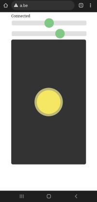

# HoverMicropyton
Control a hovercraft or RC car with 1 servo and 1 motor using your smartphone and wifi. The user interface is in your browser and contains a joystick. The hardware is based on ESP32 and the software is written in micropython.

Video: https://www.youtube.com/watch?v=TWfIe7EutRM

## Communication
- WifiPoint / SoftAP
- SSID = hover- + 4 last hexadecimal characters of the Wifi-MAC address of the ESP32 chip
- Wifi-password: 12345678
- App: browser (Chrome, Firefox, safari, ...)
- URL : http://192.168.4.1 of http://h.be

## App User interface 

- Text line: connection status
- First slider: trim servo
- Second slider: maximum speed  (minimum: 1/2 power, max: full power)
- Joystick: control servo (left/right) and motor (middle-up)

## Pin allocation ESP32
Use ESP32 chip e.g. Lolin32 Lite

| Function      | GPIO   |
| ------------- | ------ |
| LEDCONNECTION | GPIO22 |
| SERVO         | GPIO12 |
| MOTOR         | GPIO2  |

## Installation
To use this software you need a chip based on ESP32 with micropython firmware installed. You will alse need some software to upload the code and html file.
An easy way is to use the Thonny IDE to upload the firmware and install the software. A nice tutorial can be found at https://randomnerdtutorials.com/getting-started-thonny-micropython-python-ide-esp32-esp8266/

## Micropython libraries
Following libraries are used:
 * https://github.com/miguelgrinberg/microdot
 This library can be installed using the library manager of Thonny IDE. In case you prefer a manual installation, the following files are used:
: microdot.py, microdot_asyncio.py, microdot_asyncio_websocket.py, microdot_websocket.py
 * https://github.com/jczic/MicroDNSSrv
    only file microDNSSrv.py is used
 * micropython-logging
can be installed using the Thonny IDE

## ESP8266 (ESP01, NodeMCU, Wemos D1 lite, ..)
This software probably doesn't run on ESP8266 based chips, due to low memory. You can use the Arduino version instead, see https://github.com/FedericoBusero/Wifi-Hovercraft-Browser

## ESP32-S2
This software runs on ESP32-S2, it has been tested with lolin S2. Copy boot_lolins2.py to your device as boot.py. Make sure to upgrade the firmware to minimum 1.19, as it doesn't work in 1.18!

## ESP32-C3
This software runs on ESP32-C3 it has been tested with lolin C3. Copy boot_lolinc3.py to your device as boot.py. There is a timer bug in V1.19.1, the software works correct in V1.19.1-962.

## How do you make such a cool hovercraft?
Instructions can be found at https://drive.google.com/file/d/1SUZypw2QWQQqCWgGDMl3Ls_pUvmDDozy/view?usp=sharing The language is Dutch, but the manual contains a lot of pictures. The maker is MasynMachien: https://www.instructables.com/masynmachiens-workshops/
